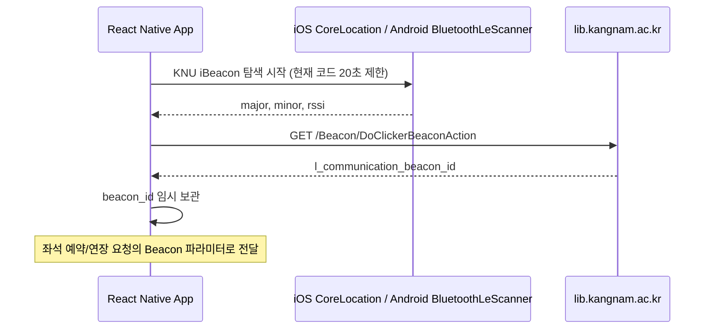

# KNU Library Beacon Analysis - Current Agent Context

이 문서는 비콘 인증 흐름을 에이전트가 빠르게 파악하기 위한 보조 자료다. 최신 코드 기준은 `src/services/beaconService.ts`, `src/api/seatApi.ts`, `modules/beacon-ranging/`이다.

## 1. 현재 구현 요약



## 2. 핵심 상수

| 항목 | 현재 값 |
|---|---|
| iBeacon UUID | `24ddf411-8cf1-440c-87cd-e368daf9c93e` |
| API 전달용 Uid | `24ddf4118cf1440c87cde368daf9c93e` |
| Beacon name | `RECO` |
| 현재 앱 스캔 타임아웃 | `20_000ms` |

원본 Android 앱 분석 기록에는 10초 타임아웃이 남아 있지만, 현재 React Native 구현은 실제 탐색 안정성을 위해 20초를 사용한다.

## 3. 플랫폼별 구현

### iOS

- Core Bluetooth는 iBeacon advertising data 접근이 제한되므로 CoreLocation ranging을 사용한다.
- 네이티브 모듈 위치: `modules/beacon-ranging/`
- JS 진입점: `scanWithNativeRanging()` in `src/services/beaconService.ts`
- 권한: `NSLocationWhenInUseUsageDescription`, `NSBluetoothAlwaysUsageDescription`

### Android

- `modules/beacon-ranging`의 Android Expo module이 `BluetoothLeScanner`로 BLE advertisement를 스캔한다.
- 네이티브 Kotlin 코드에서 iBeacon manufacturer data의 UUID, major, minor를 파싱한다.
- Android 12 이상은 `BLUETOOTH_SCAN`, `BLUETOOTH_CONNECT`, `ACCESS_FINE_LOCATION` 권한이 필요하다.
- Android 11 이하는 `ACCESS_FINE_LOCATION`이 필요하다.
- Android는 BLE 스캔 전에 위치 서비스 활성화 여부도 확인한다.

## 4. 서버 인증 API

```http
GET /Beacon/DoClickerBeaconAction
  ?Uid=24ddf4118cf1440c87cde368daf9c93e
  &UserId={Sponge_URL_Encoded_ID}
  &UserPass={Sponge_URL_Encoded_PW}
  &Name=RECO
  &Major={major}
  &Minor={minor}
  &Rssi={rssi}
  &Wifi={ssid}
  &WifiMac={bssid}
```

현재 `src/api/seatApi.ts`는 `UserId`, `UserPass`에 `spongeEncrypt()`를 적용한다. 과거 문서의 Plain Text 설명을 기준으로 구현을 되돌리지 않는다.

## 5. 응답 필드

| 필드 | 용도 |
|---|---|
| `l_communication_status` | `"1"`이면 비콘 인증 성공 |
| `l_communication_beacon_id` | 좌석 예약/연장/퇴실의 `Beacon` 파라미터 |
| `l_communication_clicker_roomname` | 인증된 열람실 이름 표시 |
| `l_communication_on_seat` | 이미 착석 중인지 판단 |
| `l_communication_message` | 실패 또는 안내 메시지 |

## 6. 검증 포인트

- iOS 실제 기기에서 CoreLocation ranging 권한 팝업과 결과 수신 확인
- Android 실제 기기에서 BLE 권한 팝업, Bluetooth powered-on 상태, 위치 서비스 활성화 상태, native manufacturer data 파싱 확인
- `l_communication_beacon_id`가 예약/연장 요청에 전달되는지 확인
- 타임아웃 메시지가 사용자에게 과도하게 빨리 표시되지 않는지 확인
- 서버 실패 메시지를 그대로 Alert로 노출하는지 확인

시뮬레이터에서는 실제 비콘 검증이 제한되므로, 검증하지 못한 경우 문서에 명확히 남긴다.
