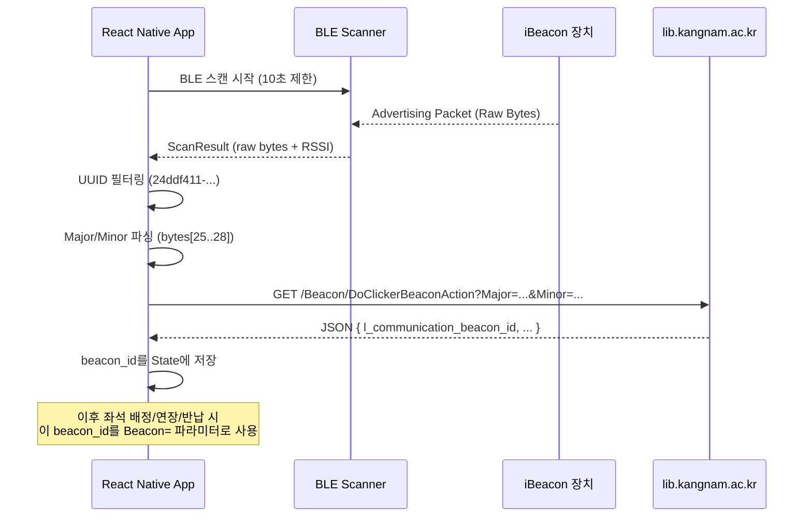

# KNU 도서관 앱 비콘(BLE) 탐색 코드 분석

## 1. 전체 흐름 요약



---

## 2. 핵심 상수

| 항목 | 값 | 출처 |
|---|---|---|
| **iBeacon UUID** | `24ddf411-8cf1-440c-87cd-e368daf9c93e` | [BeaconBleCheck.java:66](file:///Users/melee/Desktop/knulib_decomp/java_source/sources/kr/ac/library/knul/BeaconBleCheck.java#L66) |
| **UUID (대시 제거)** | `24ddf4118cf1440c87cde368daf9c93e` | API 호출 시 사용 |
| **BLE 스캔 타임아웃** | `10,000ms` (10초) | [BeaconBleCheck.java:29](file:///Users/melee/Desktop/knulib_decomp/java_source/sources/kr/ac/library/knul/BeaconBleCheck.java#L29) |
| **Beacon 이름** | `RECO` | [BeaconBleCheck.java:326](file:///Users/melee/Desktop/knulib_decomp/java_source/sources/kr/ac/library/knul/BeaconBleCheck.java#L326) |

---

## 3. BLE 스캔 로직 상세 분석

### 3.1 스캔 시작 ([scanLeDevice](file:///Users/melee/Desktop/knulib_decomp/java_source/sources/kr/ac/library/knul/BeaconBleCheck.java#L286-L321))

```java
// Android BLE API 사용 (BluetoothLeScanner)
BluetoothLeScanner scanner = BluetoothAdapter.getDefaultAdapter().getBluetoothLeScanner();
scanner.startScan(scanCallback);   // 필터 없이 모든 BLE 장치 스캔

// 10초 후 자동 스캔 중지
new Handler().postDelayed(() -> {
    scanner.stopScan(scanCallback);
}, 10000);
```

> [!IMPORTANT]
> 원본 앱은 **필터 없이** 전체 BLE 장치를 스캔한 뒤, `ScanCallback` 내부에서 UUID를 직접 비교하여 필터링합니다.

### 3.2 iBeacon 패킷 파싱 ([LCCommon.java:981-997](file:///Users/melee/Desktop/knulib_decomp/java_source/sources/kr/ac/library/knul/LCCommon.java#L981-L997))

iBeacon 광고 패킷 바이트 배열에서 UUID, Major, Minor를 직접 파싱합니다:

```
바이트 오프셋 구조 (Apple iBeacon 표준):
┌─────────────────────────────────────────────────────────┐
│ [5]=0x4C [6]=0x00  → Apple Company ID (iBeacon 식별자)  │
│ [7]=0x02 [8]=0x15  → iBeacon 타입 + 길이               │
│ [9..24]            → UUID (16 bytes)                    │
│ [25..26]           → Major (2 bytes, big-endian)        │
│ [27..28]           → Minor (2 bytes, big-endian)        │
└─────────────────────────────────────────────────────────┘
```

```java
// UUID 검증: bytes[5]==0x4C && bytes[6]==0x00 && bytes[7]==0x02 && bytes[8]==0x15
public String getUUID(byte[] b) {
    if (b[5]==76 && b[6]==0 && b[7]==2 && b[8]==21) {
        // b[9]~b[24] → 16바이트를 hex 문자열로 변환 (대시 포함)
    }
}

// Major: bytes[25]*256 + bytes[26]
public String getMajor(byte[] b) {
    return String.valueOf(((b[25] & 0xFF) * 256) + (b[26] & 0xFF));
}

// Minor: bytes[27]*256 + bytes[28]
public String getMinor(byte[] b) {
    return String.valueOf(((b[27] & 0xFF) * 256) + (b[28] & 0xFF));
}
```

### 3.3 UUID 필터링 ([BeaconBleCheck.java:66](file:///Users/melee/Desktop/knulib_decomp/java_source/sources/kr/ac/library/knul/BeaconBleCheck.java#L66))

```java
// 파싱한 UUID를 소문자로 변환 후 하드코딩된 값과 직접 비교
if (getUUID(bytes).toLowerCase().equals("24ddf411-8cf1-440c-87cd-e368daf9c93e")) {
    // ✅ 강남대 도서관 비콘 확인됨 → Major/Minor 추출
    String major = getMajor(bytes);  // 예: "10001"
    String minor = getMinor(bytes);  // 예: "103"
    int rssi = scanResult.getRssi(); // 신호 세기
}
```

### 3.4 중복 방지 로직 ([BeaconBleCheck.java:71-87](file:///Users/melee/Desktop/knulib_decomp/java_source/sources/kr/ac/library/knul/BeaconBleCheck.java#L71-L87))

같은 Minor 값을 가진 비콘이 이미 발견되었으면 무시합니다:
```java
// BleScanArray에서 동일 minor가 있는지 순회 확인
for (HashMap item : BleScanArray) {
    if (item.get("minor").equals(minor)) {
        return; // 이미 처리된 비콘 → 스킵
    }
}
// 새로운 비콘 → API 호출
BleScanArray.add({major, minor});
ReadBeaconJson(major, minor, rssi);
```

### 3.5 서버 API 호출 ([ReadBeaconJson](file:///Users/melee/Desktop/knulib_decomp/java_source/sources/kr/ac/library/knul/BeaconBleCheck.java#L323-L378))

발견된 비콘 정보를 서버에 전송하여 인증합니다:

```
GET /Beacon/DoClickerBeaconAction
  ?Uid=24ddf4118cf1440c87cde368daf9c93e
  &Mac=
  &UserId={학번}
  &UserPass={URL_ENCODE(비밀번호)}
  &Name=RECO
  &Major={major}
  &Minor={minor}
  &Rssi={rssi}
  &Wifi={wifi_ssid}
  &WifiMac={mac_address}
  &Token=
```

### 3.6 API 응답에서 추출하는 핵심 필드

| 필드 | 타입 | 용도 |
|---|---|---|
| `l_communication_status` | `string` | `"1"` = 인증 성공 |
| `l_communication_beacon_id` | `string` | **좌석 배정/연장/취소에 사용할 Beacon ID** |
| `l_communication_clicker_type` | `string` | `"5"` = 열람실, `"6"` = 기타 |
| `l_communication_clicker_id` | `string` | 열람실/좌석 식별자 |
| `l_communication_clicker_roomname` | `string` | 열람실 이름 (UI 표시용) |
| `l_communication_on_seat` | `string` | `"1"` = 이미 착석 중, `"0"` = 빈 좌석 |
| `l_communication_task` | `string` | `"1"` = 좌석정보, `"g"` = 그룹코드기반, 기타 |
| `l_communication_message` | `string` | 사용자에게 보여줄 메시지 |

> [!CAUTION]
> 서버 응답의 `l_communication_beacon_id`는 `{UUID}-{Major}-{Minor}` 형식 (예: `24ddf4118cf1440c87cde368daf9c93e-10001-103`)이며, 이 값이 이후 좌석 배정 API의 `Beacon=` 파라미터로 전달됩니다.

---

## 4. React Native 구현 가이드

### 4.1 권장 라이브러리

| 라이브러리 | 설명 |
|---|---|
| **`react-native-ble-plx`** | 가장 널리 사용되는 RN BLE 라이브러리. 로우레벨 스캔 + 데이터 파싱 가능 |
| **`@nicejustdoeverything/react-native-ibeacon`** | iBeacon 특화 라이브러리 (Major/Minor 자동 파싱) |
| **`react-native-beacons-manager`** | iOS CLLocationManager + Android AltBeacon 기반 |

> [!TIP]
> 원본 앱은 iBeacon 라이브러리 없이 **raw BLE 스캔 + 수동 바이트 파싱**을 하고 있습니다. React Native에서는 `react-native-ble-plx`의 `startDeviceScan()`으로 동일한 접근이 가능합니다.

### 4.2 구현 핵심 로직 (의사 코드)

```typescript
import { BleManager } from 'react-native-ble-plx';
import { Buffer } from 'buffer';

const KNULIB_BEACON_UUID = '24ddf411-8cf1-440c-87cd-e368daf9c93e';
const SCAN_TIMEOUT_MS = 10000;

function parseIBeacon(manufacturerData: string) {
  const bytes = Buffer.from(manufacturerData, 'base64');

  // Apple iBeacon 헤더 검증: 0x4C00 0215
  if (bytes[0] !== 0x4C || bytes[1] !== 0x00 || bytes[2] !== 0x02 || bytes[3] !== 0x15) {
    return null;
  }

  // UUID 파싱 (bytes 4~19)
  const uuidBytes = bytes.slice(4, 20);
  const uuid = [
    uuidBytes.slice(0, 4).toString('hex'),
    uuidBytes.slice(4, 6).toString('hex'),
    uuidBytes.slice(6, 8).toString('hex'),
    uuidBytes.slice(8, 10).toString('hex'),
    uuidBytes.slice(10, 16).toString('hex'),
  ].join('-');

  // Major (bytes 20~21), Minor (bytes 22~23)
  const major = bytes.readUInt16BE(20);
  const minor = bytes.readUInt16BE(22);

  return { uuid, major, minor };
}

async function scanForKNUBeacons() {
  const manager = new BleManager();
  const discoveredMinors = new Set<number>();

  manager.startDeviceScan(null, null, (error, device) => {
    if (error || !device?.manufacturerData) return;

    const beacon = parseIBeacon(device.manufacturerData);
    if (!beacon) return;

    // UUID 필터링
    if (beacon.uuid.toLowerCase() !== KNULIB_BEACON_UUID) return;

    // 중복 방지
    if (discoveredMinors.has(beacon.minor)) return;
    discoveredMinors.add(beacon.minor);

    // ✅ 서버 API 호출
    callBeaconAuthAPI(beacon.major, beacon.minor, device.rssi);
  });

  // 10초 후 스캔 중지
  setTimeout(() => manager.stopDeviceScan(), SCAN_TIMEOUT_MS);
}
```

> [!WARNING]
> `react-native-ble-plx`의 `manufacturerData`는 **Company ID(0x004C)를 제외한** 나머지 바이트만 제공할 수 있습니다. 실제 오프셋은 라이브러리에 따라 달라지므로, 실제 비콘 장치에서 반환되는 데이터의 바이트 구조를 디버깅하며 조정하세요.

### 4.3 필요한 퍼미션

**Android** (`AndroidManifest.xml`):
```xml
<uses-permission android:name="android.permission.BLUETOOTH_SCAN" />
<uses-permission android:name="android.permission.BLUETOOTH_CONNECT" />
<uses-permission android:name="android.permission.ACCESS_FINE_LOCATION" />
```

**iOS** (`Info.plist`):
```xml
<key>NSBluetoothAlwaysUsageDescription</key>
<string>도서관 비콘 인증을 위해 블루투스가 필요합니다</string>
<key>NSLocationWhenInUseUsageDescription</key>
<string>비콘 탐색을 위해 위치 권한이 필요합니다</string>
```
