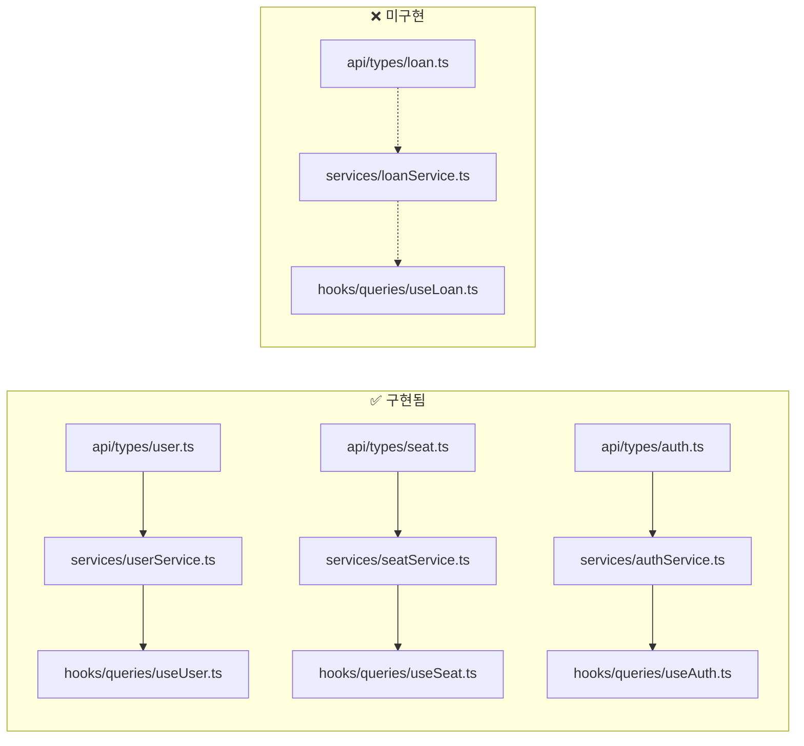

# 📋 KNU Library 코드베이스 검토 보고서

> PRD 준수 여부 및 클린 아키텍처 관점에서의 종합 검토

---

## 1. 아키텍처 구조 검토 (Layered Architecture)

PRD에서 정의한 아키텍처: `src/api` → `src/services` → `src/hooks` → `src/components`

### ✅ 잘 되어 있는 점
| 레이어 | 상태 | 설명 |
|---|---|---|
| `src/api/instances.ts` | ✅ | Axios 인스턴스, 인터셉터 설정 적절 |
| `src/api/types/` | ✅ | API 타입 분리 |
| `src/services/userService.ts` | ✅ | API 호출 로직을 서비스로 분리 |
| `src/hooks/queries/useUser.ts` | ✅ | React Query 커스텀 훅 패턴 준수 |
| `src/components/Text.tsx` | ✅ | 재사용 가능한 공통 컴포넌트 |

### ⚠️ 문제점

#### 1-1. `src/screens/` 폴더의 역할 불명확
- [ProfileScreen.tsx](file:///Users/melee/Documents/KNU_library/src/screens/ProfileScreen.tsx)이 존재하지만 **어디서도 사용되지 않음**
- PRD에 프로필 화면은 명시되어 있지 않음
- `app/` 폴더가 Expo Router의 라우트 역할을 하므로, `src/screens/`와 `app/`의 역할이 중복될 수 있음

#### 1-2. 컴포넌트에 비즈니스 로직 직접 포함
- [StudentCard.tsx](file:///Users/melee/Documents/KNU_library/src/components/StudentCard.tsx): 학생 정보가 **하드코딩**되어 있음 (이태규, 202002502 등)
- [SeatStatusCard.tsx](file:///Users/melee/Documents/KNU_library/src/components/SeatStatusCard.tsx): 좌석 데이터가 **하드코딩** (제1열람실, 124번, 01:42:10 등)
- [LoanSummaryCard.tsx](file:///Users/melee/Documents/KNU_library/src/components/LoanSummaryCard.tsx): 대출 데이터가 **하드코딩** (자바 프로그래밍, 이산수학 등)

> [!NOTE]
> 클린 아키텍처에서는 컴포넌트가 데이터를 직접 알지 않아야 합니다. **좌석(seat)** 도메인은 서비스/훅 레이어가 완성되었으며, **대출(loan)** 도메인은 아직 미구현 상태입니다.

#### 1-3. `src/types/` 폴더가 빈 상태
- 타입 정의가 `src/api/types/`에만 존재
- 공유 타입이나 도메인 모델용 타입이 없음

---

## 2. PRD 기능 준수 여부

### 2.1. 인증 및 로그인 (Auth Flow)

| 요구사항 | 상태 | 현재 |
|---|---|---|
| 별도 로그인 화면 (`app/login.tsx`) | ❌ 미구현 | 파일 자체가 없음 |
| 인증 토큰 저장 (Zustand/SecureStore) | ❌ 미구현 | 상태관리 라이브러리 미설치 |
| 로그인 → 홈 라우팅 | ❌ 미구현 | — |

### 2.2. 학생 정보 & QR 코드 (우선순위 1)

| 요구사항 | 상태 | 현재 |
|---|---|---|
| 이름, 학번, 소속1, 소속2 표시 | ⚠️ 하드코딩 | 서버 연동 없이 정적 값 |
| 동적 QR 코드 | ✅ 구현됨 | `react-native-qrcode-svg` 사용, 타임스탬프 포함 |
| QR 생성 시각 표시 | ✅ 구현됨 | `formatDate()` 한국어 포맷 |
| Pull-to-Refresh로 QR 재발급 | ⚠️ 부분구현 | `RefreshControl` 존재하나 **실제 refetch 로직 연결 안 됨** |
| QR 만료 시 비활성화 처리 | ❌ 미구현 | 만료 로직 없음 |

### 2.3. 좌석 현황 관리

| 요구사항 | 상태 | 현재 |
|---|---|---|
| 장소/좌석번호/상태뱃지 표시 | ✅ 구현됨 | `useSeatState` 훅으로 실시간 데이터 연동 |
| 프로그레스 바 + 타임스탬프 | ⚠️ 부분구현 | 데이터 연동 완료, 프로그레스 바 동적 계산 필요 |
| Empty State ("이용 중인 좌석이 없습니다") | ✅ 구현됨 | `UserState.IDLE` 시 Empty State 표출 |
| 좌석 예약 화면 연결 (`seat-reservation`) | ✅ 구현됨 | `app/(tabs)/rooms.tsx` → `app/(tabs)/seat-reservation.tsx` 라우트 연결 |
| 퇴실하기/연장하기 API 호출 | ✅ 구현됨 | `useReleaseSeat`, `useExtendSeat` 뮤테이션 훅 연동 |

### 2.4. 대출 현황 관리

| 요구사항 | 상태 | 현재 |
|---|---|---|
| 총 대출 권수 표기 | ⚠️ 하드코딩 | `6` 고정값 |
| 도서 리스트 2~3개 표시 | ⚠️ 하드코딩 | 2개 고정 |
| D-Day 뱃지 | ✅ 구현됨 | UI 적절 |
| 전체보기 → 도서 전체 목록 화면 | ❌ 미구현 | `loan-details.tsx` 라우트 없음, 핸들러 주석 처리 |
| 개별 연장하기 버튼 | ❌ 미구현 | 리스트 아이템에 연장 버튼 없음 |
| 연장불가 비활성화 처리 | ❌ 미구현 | — |

### 2.5. 글로벌 제어 (Pull-to-Refresh)

| 요구사항 | 상태 | 현재 |
|---|---|---|
| RefreshControl으로 전체 데이터 리패칭 | ⚠️ 부분구현 | `setTimeout`으로만 처리, **React Query `refetch` 미연동** |

---

## 3. 라우팅 구조 비교

```diff
# PRD 요구사항                    # 현재 구현
- app/login.tsx                  ← ✅ 구현됨
- app/(tabs)/index.tsx           ← ✅ 구현됨 (탭 구조)
- app/(tabs)/rooms.tsx           ← ✅ 구현됨 (열람실 목록)
- app/(tabs)/seat-reservation.tsx← ✅ 구현됨 (좌석 선택 맵)
- app/loan-details.tsx           ← ⚠️ 라우트 파일 존재, 기능 미완성
```

> [!WARNING]
> PRD에서는 `app/(tabs)/index.tsx`로 탭 기반 네비게이션을 명시했지만, 현재는 `app/index.tsx`로 단순 스택 네비게이션만 사용 중입니다.

---

## 4. 데이터 레이어 누락 분석

현재 데이터 레이어가 구축된 도메인: **User** (1개)만



> 점선(-.->)은 **필요하지만 아직 생성되지 않은** 파일을 의미합니다.

---

## 5. 기타 코드 품질 이슈

| 이슈 | 파일 | 설명 |
|---|---|---|
| Import 경로 불일치 | [index.tsx](file:///Users/melee/Documents/KNU_library/app/index.tsx) | `@/components/Text` (alias)와 `../src/components/StudentCard` (상대경로) 혼용 |
| 미사용 import | [SeatStatusCard.tsx](file:///Users/melee/Documents/KNU_library/src/components/SeatStatusCard.tsx#L4) | `useRouter` import 후 미사용 |
| 미사용 import | [LoanSummaryCard.tsx](file:///Users/melee/Documents/KNU_library/src/components/LoanSummaryCard.tsx#L4) | `useRouter` import 후 실제 라우팅 코드 주석 처리 |
| User 타입 불완전 | [user.ts](file:///Users/melee/Documents/KNU_library/src/api/types/user.ts) | PRD 요구사항(학번, 소속1, 소속2) 필드 없음 |

---

## 6. 종합 평가

| 카테고리 | 점수 | 요약 |
|---|---|---|
| 아키텍처 구조 | **8/10** | User, Auth, Seat 3개 도메인에 레이어 적용 완료 |
| PRD 기능 준수 | **6/10** | 인증, QR, 좌석 핵심 기능 구현 완료, 대출 도메인 미완성 |
| 코드 품질 | **7/10** | Clean Architecture 준수, Sponge 암호화 실구현, 일부 import 불일치 잔존 |
| 기술 스택 준수 | **9/10** | Expo, React Query, Axios, StyleSheet, expo-router 모두 올바르게 사용 |

> [!NOTE]
> Seat 도메인의 Clean Architecture 리팩터링과 Sponge 암호화 이식이 완료되어 실제 서버 통신이 가능해졌습니다. 다음 단계에서는 **Loan** 도메인 데이터 레이어를 구축하고, 프로그레스 바 동적 계산 등 세부 UI 기능을 보완하는 것이 권장됩니다.

## 7. 수정된 버그 이력

| 버그 | 원인 | 수정 내용 | 관련 파일 |
|---|---|---|---|
| Session Expired 오류 | `l_communication_status === "0"`을 UNAUTHORIZED로 판별 (반대) | `!== "0"`으로 수정 | `seatService.ts` |
| 서버 인증 거부 | `spongeEncrypt`가 mock(base64)으로 구현 | `knulib_api.py` 기반 실제 알고리즘 이식 | `crypto.ts` |
