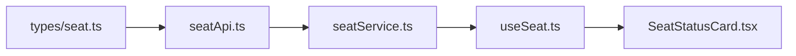

# 🔍 Seat Domain 구현 종합 검토 보고서

전체 좌석 도메인의 구현이 최선이었는지에 대한 종합 검토 결과입니다.

---

## 1. 아키텍처 준수 여부 — ✅ 우수

현재 구조는 PRD에서 정의한 Strict Layered Architecture를 잘 따르고 있습니다.



| 레이어 | 역할 | 준수 여부 |
|---|---|---|
| `api/types/seat.ts` | 타입 정의 전용 | ✅ |
| `api/seatApi.ts` | 순수 HTTP 호출 | ✅ |
| `services/seatService.ts` | 비즈니스 로직 캡슐화 | ✅ |
| `hooks/queries/useSeat.ts` | Thin Query/Mutation Hook | ✅ |
| `components/SeatStatusCard.tsx` | 순수 프레젠테이션 | ✅ |

---

## 2. 레이어별 이슈 분석

### 🔴 심각 (즉시 수정 필요)

#### 2-1. 디버그 로그가 프로덕션 코드에 잔존

[seatService.ts](file:///Users/melee/Documents/KNU_library/src/services/seatService.ts)와 [useSeat.ts](file:///Users/melee/Documents/KNU_library/src/hooks/queries/useSeat.ts)에 개발 시 추가한 `console.log`가 그대로 남아 있습니다.

> [!CAUTION]
> 특히 `seatService.ts` 10번째 줄에서 **API 응답 전체를 JSON.stringify로 출력**하고 있어, 사용자 비밀번호(`l_clicker_user_password`)가 터미널에 노출됩니다.

```diff
- console.log('[seatService] determineUserState input:', JSON.stringify(response, null, 2));
- console.log('[seatService] fetchSeatStatus received data:', data);
- console.log('[useSeatState] queryFn executing. Session id exists:', ...);
```

#### 2-2. Beacon/Reserve/Extend/Release API에서 암호화 불일치

[knulib_api.py](file:///Users/melee/Documents/KNU_library/knulib_api.py)의 파이썬 참조 구현을 보면, `doBeaconAction`에서 `UserId`에 **Sponge 암호화**를 적용합니다:

```python
# knulib_api.py line 198-199
enc_id = sponge_encrypt(USER_ID)      # ← Sponge 암호화
enc_pw = url_encode(sponge_encrypt(USER_PASS))
```

과거 구현에서는 다음처럼 인증값을 그대로 URL 인코딩하는 코드가 있었다:
```typescript
const encodedId = encodeURIComponent(id);
const encodedPw = encodeURIComponent(pw);
```

현재 코드의 `reserveSeat`, `extendSeat`, `releaseSeat`, `doBeaconAction`은 Python 참조와 동일한 방향으로 `spongeEncrypt()`를 적용합니다. 이 문서의 초기 지적은 과거 구현 상태에 대한 기록이며, 현재 기준에서는 해결된 항목입니다.

---

### 🟡 중간 (개선 권장)

#### 2-3. 인증 정보 주입 방식 불일치 (이중 경로)

현재 인증 정보(id, pw)가 두 가지 다른 경로로 주입되고 있습니다:

| 함수 | 주입 방식 |
|---|---|
| `useSeatState`, `useReadingRoomSeats` | Hook에서 `useAuthSession()` → Service에 id/pw 전달 |
| `useBeaconAuth`, `useReserveSeat`, `useExtendSeat`, `useReleaseSeat` | Service 내부에서 `getStoredSession()` 직접 호출 |

이 이원화는 일관성을 해칩니다. **모든 Service 함수가 내부적으로 `getStoredSession()`을 호출**하도록 통일하면, Hook이 인증 정보를 알 필요 자체가 없어져 더 깔끔해집니다.

#### 2-4. `parseTimeString`이 컴포넌트에 위치

[SeatStatusCard.tsx](file:///Users/melee/Documents/KNU_library/src/components/SeatStatusCard.tsx#L15-L25)에 있는 `parseTimeString`, `formatHHMM`, `formatRemaining` 함수들은 **시간 문자열 파싱이라는 비즈니스 로직**입니다. `seatService.ts`나 별도 유틸리티(`src/utils/dateUtils.ts`)로 이동하는 것이 Clean Architecture에 부합합니다.

#### 2-5. `transientBeaconId` 모듈 변수 패턴

[useSeat.ts:22-23](file:///Users/melee/Documents/KNU_library/src/hooks/queries/useSeat.ts#L22-L23)의 `transientBeaconId`는 모듈 스코프 변수입니다. React의 상태 관리 영역 밖에 있어 **Hot Reload 시 초기화되지 않고**, 디버깅이 어렵습니다. `useMutation`의 반환값으로 비콘 ID를 전달하거나, React Query의 캐시에 저장하는 방식이 더 안전합니다.

#### 2-6. `requestSeatExtension/Release`에 seatId 누락

```typescript
// seatService.ts line 123
return await extendSeat('', session.credentials.id, ...);  // ← seatId가 빈 문자열
```

Python 참조 코드에서는 현재 이용 중인 좌석의 `seat_id`를 명확히 전달합니다. 서버가 세션 기반으로 처리할 수도 있지만, 명세대로 `GetMyInformation` 응답의 `l_clicker_user_status_seat_id`를 전달하는 것이 정확합니다.

---

### 🟢 경미 (선호사항)

#### 2-7. SeatReservationScreen UI 텍스트가 영어

[SeatReservationScreen.tsx](file:///Users/melee/Documents/KNU_library/src/screens/SeatReservationScreen.tsx)의 모든 Alert과 Button 텍스트가 영어("Location Verification Required", "Reserve Seat" 등)로 되어 있습니다. 앱의 나머지 부분은 한국어이므로 통일이 필요합니다.

#### 2-8. `GetMyInfoResponse` 타입이 실제 응답 필드 일부만 정의

실제 API 응답에는 `l_clicker_user_name`, `l_clicker_user_depart_name`, `l_clicker_user_status` 등 유용한 필드가 훨씬 많지만, 현재 타입 정의에는 핵심 필드만 포함되어 있습니다. 필요에 따라 확장하면 좋습니다.

---

## 3. 잘 구현된 점

| 항목 | 설명 |
|---|---|
| Query Key 팩토리 패턴 | `SEAT_KEYS` 객체로 키를 중앙 관리하여 invalidation이 견고함 |
| 뮤테이션 후 캐시 무효화 | `onSuccess`에서 `invalidateQueries`를 호출하여 UI가 즉시 갱신됨 |
| 프로그레스 바 자동 갱신 | `setInterval`로 30초마다 `now`를 업데이트하여 남은 시간이 살아있음 |
| Sponge 암호화 정확 이식 | Python 참조와 동일한 START/STOP/PAD 상수 및 역순+랜덤패딩 로직 |
| 에러 핸들링 패턴 | 모든 mutation에서 `onError` 콜백으로 사용자에게 Alert을 제공 |

---

## 4. 우선순위별 개선 작업 요약

| 순위 | 작업 | 영향 |
|---|---|---|
| 🔴 1 | 디버그 `console.log` 전부 제거 | 보안 (비밀번호 노출) |
| 🔴 2 | Beacon/Reserve/Extend/Release API에 Sponge 암호화 적용 | API 안정성 |
| 🟡 3 | 인증 정보 주입 방식 통일 (Service 내부 주입으로) | 코드 일관성 |
| 🟡 4 | `parseTimeString` 등 유틸 함수를 Service/Utils로 이동 | 아키텍처 |
| 🟡 5 | `seatId`를 extend/release에 올바르게 전달 | 현재 `src/services/seatService.ts`는 상태 조회 캐시의 seatId를 사용 |
| 🟢 6 | SeatReservationScreen 한국어화 | UX 일관성 |
| 🟢 7 | `GetMyInfoResponse` 타입 확장 | 타입 안전성 |
